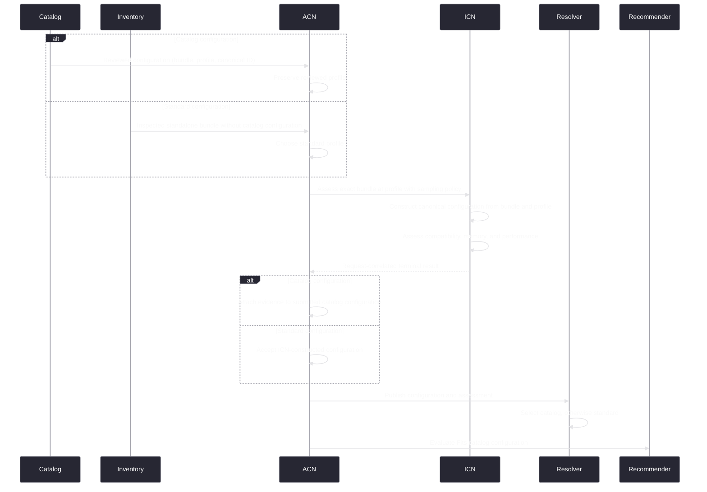

---
applies_to:
  - inference/crates/icn-hardware/**
  - inference/crates/icn-models/**
  - inference/crates/icn-api/**
  - packages/icn/src/hardware/**
  - packages/acn/src/local-model-**
  - packages/acn-protocol/src/schemas/model-state.ts
  - cli/src/features/model-setup/**
  - web/src/components/local-model-onboarding.tsx
  - web/src/components/model-center.tsx
---

# Model assessment and recommendation

Terms follow [Model-management terminology](./terminology.md). How fit is estimated and what the
engine's own memory reservation is follow [the EIM container backend](../icn/eim-containers.md) and
[ICN model fit assessment](../../info/inference/fit-estimation.md).

## Ownership

| Concern | Owner |
|---|---|
| Native compatibility, memory, placement, performance | ICN |
| Serving-configuration construction, canonical identity, validation | ICN |
| Profile set, orchestration, recommendation policy | ACN |
| Rendering | Clients |

## Pipeline



ACN always supplies the serving profile used for assessment. For catalog input it preserves the
reviewed profile; standard input requires ACN to choose one by policy. ICN
always constructs and canonically identifies the exact serving configuration for the supplied
bundle and profile. Each ACN request carries one or more unique profiles. The response is correlated
first by exact request identity and then by exact profile identity within that request. For catalog
intent, ACN attaches the returned evidence to the submitted catalog configuration. For standard
intent, ACN accepts the ICN-constructed configuration. ACN never compares copied configuration
records to correlate a result.

The rejection proof compares exact, content-deduplicated tensor storage with aggregate stable
physical capacity. Uncertain bundles proceed. File/download size is not rejection evidence.
GGUF-derived identity and tensor storage share one optimistic inspection cache per immutable
component. Package capabilities compose the inspected primary artifact with exact component roles,
relationships, and native projector inspection. An absent or malformed cache entry reparses the
component and cannot change artifact presence.

## Assessment service

ACN exposes one assessment executor accepting exact bundles and profiles. It owns the
scoped lifecycle, deadline, ICN batching, result decoding, cardinality checks, and finalization.
Every executor request carries one bundle and one or more unique profiles so ICN can share model
opening across their assessment. Missing, duplicate, or unrequested profile outcomes violate the
assessment operation contract; they fail the operation rather than becoming a model compatibility
or capacity state.
One ACN local-model assessor owns demand for each catalog model's desired configuration, its
installed effective configuration when different, and standard profile decisions made only for
inspected uncatalogued packages. Desired catalog assessment supports recommendation and acquisition;
effective catalog assessment supports current serving. ACN supplies the chosen bundle and profile for standard demand;
ICN constructs and identifies the corresponding serving configuration as part of assessment.
Recommendation, provider-offering, and local-model projections consume its state and
never invoke assessment independently. Recommendation policy consumes only release-catalog
candidates. Each release-catalog configuration uses its reviewed catalog profile. ACN chooses the
standard profile bounded by the package maximum for an inspected standalone package only when no
catalog configuration exists for that bundle. ICN, not ACN, constructs and canonically identifies the
resulting configuration. Package installation origin does not affect this decision. An installed
catalog target is never reclassified as a standard model merely because its desired bundle differs;
it remains the effective configuration of the same `CatalogIdentity`.

ICN persists every completed exact profile result, including `DoesNotFit`, and performs
single-flight native work. Repeated reads consume current results and do not trigger native
assessment.

The assessor is a scoped background owner. Constructing ACN services publishes initial
observable state without waiting for assessment; only the admitted operation owner awaits its
bounded native request.

## Demand and invalidation

The assessor reconciles current snapshots rather than treating notifications as semantic
changes:

```text
source invalidation
       |
       v
coalesce -> read snapshots -> compute semantic assessment keys
                                      |
                          +-----------+-----------+
                          |                       |
                       unchanged                changed
                          |                       |
                    retain result          assess exact key
                                                  |
                                      publish only while current
```

One semantic assessment key contains the complete serving configuration, resolved immutable
assessment material, stable topology and capacity identity, native build and enabled backends,
calibration identity, assessment method and policy, and requested performance-depth policy.

Download bytes, transfer speed, model-download or package-attempt identity, package or inventory revision, catalog
presentation, live free memory, provider state, slot state, runtime residency, and client activity
are not assessment inputs. Revisions may require a reread; revision inequality never admits native
assessment by itself.

Reconciliation is serialized and invalidations are coalesced. It assesses only new or changed keys,
preserves terminal results for unchanged keys, and removes state only when catalog and
installed-package demand no longer includes the configuration. Completion rechecks the semantic key before publication;
a result for a superseded key is discarded and reconciliation continues without overwriting newer
state.

## Publication boundary

Recommendation policy evaluates private inputs for catalog configurations with completed `Fits`
assessment. The client-facing projection does not publish a parallel candidate entity. It publishes
one `LocalModel` per exact bundle and annotates its assessed serving state with catalog ranking
evidence and any selected recommendation intents.

Performance evidence is an ordered set of samples for the same configuration. Samples above the
configured context are omitted, and the final sample is always the configured context.

Recommendation evidence is present only when the bundle is active in the recommendable catalog.
Deprecated catalog configurations remain resolvable and assessable but receive no fabricated
intelligence, fidelity, quality, or recommendation evidence.

`DoesNotFit` and `Incompatible` are completed evidence but are not selectable. Missing,
`Assessing`, canceled, or defective work is not published as a successful empty portfolio.
Installed packages remain present in the [local-model product projection](./local-model-product-projection.md)
independently of assessment and offering publication.

## Assessment lifecycle

ACN owns one shared per-configuration assessment coordinator. While admitted work for the current
semantic key is running, its internal state is `Assessing`. Completion publishes `Failed`, `Fits`,
`DoesNotFit`, or `Incompatible` for that key. Serialized reconciliation plus key validation makes
stale completion unrepresentable. Unchanged configurations retain their terminal state while
another configuration is assessed.

The product projection never publishes an absent assessment as a configuration result. An
installed model without a terminal result for its decided configuration has model-level readiness
`Assessing`; an assessed model contains exactly that configuration and its terminal result.

An assessment-operation defect publishes `Failed` with its typed failure. It is not converted into
`DoesNotFit` or `Incompatible`, and it cannot replace the local-model collection with an empty
snapshot.

## Recommendation portfolio

Selection objectives, equations, and portfolio rules are defined by
[Model recommendation](./recommendation.md). This document owns the assessment evidence and
publication lifecycle consumed by that policy.

## Invalidation

Recommendation reuse requires unchanged catalog content, profiles, stable topology and capacity,
native build and backends, hardware calibration, assessment method, and recommendation policy.
Live memory availability does not invalidate assessment or recommendation.

Onboarding therefore keeps recommendation-tier labels and explanations stable as availability
changes. Current loadability is a separate right-hand detail alongside the explanation: stable
assessment may report a tight fit while live admission headroom simultaneously reports that the
model cannot load now. Neither condition replaces or relabels the recommendation.

## Loading

Assessment proves compatibility with stable capacity for one sequence. Loading repeats native
planning, determines execution-plan sequence capacity, and applies fresh availability admission.
Cached assessment never authorizes loading.

## Conformance

- Every release-catalog choice publishes one reviewed configuration whose profile does not exceed
  its exact bundle maximum.
- For every inspected independently servable package without a catalog configuration, ACN applies
  the canonical standard-profile rule and ICN constructs and assesses its exact configuration.
- A package already participating in a catalog bundle is assessed only through that
  bundle. Separate speculative companions are never submitted again as standalone targets.
- All missing profiles for one bundle are submitted together.
- Equivalent concurrent misses perform one native assessment.
- Download progress and semantically equivalent newer source revisions perform no assessment.
- A changed semantic key reassesses only the affected configurations.
- Provider-offering and local-model projection never invoke assessment.
- Assessment completion cannot publish against a superseded semantic key.
- Assessment results correlate by exact request and profile identity, never by configuration-record comparison.
- Recommendation generation never replaces a valid portfolio with a defect-derived empty result.
- Clients display a bounded 25K-to-75K expected-speed range without context-variant candidates.
- Recommendation-policy inputs remain private; client-visible recommendation annotations preserve
  the local model's serving-configuration identity.
- Loading never treats cached assessment as admission authority.
- ACN startup and service publication never wait for model assessment.
- Onboarding keeps installed and downloadable model groups at a stable layout height while making
  every presented model reachable by keyboard navigation and pointer scrolling.
- Onboarding preserves recommendation-intent labels for installed and downloadable models in the
  model list and renders stable fit and current loadability independently in the selected model's
  detail pane.
